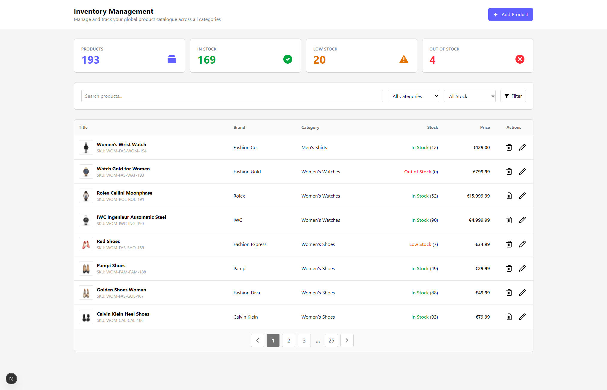

<!-- omit in toc -->
# Group 4's Web-Shop Admin panel

[](http://creativecommons.org/publicdomain/zero/1.0/)


This is group 4's admin panel for our web-shop project. The project is built with Next.js and uses json-server to mock a backend API made by the Lexicon Staff.



<!-- omit in toc -->
## Table of Contents

- [Features](#features)
- [Project Information](#project-information)
  - [Dependencies](#dependencies)
- [Getting Started](#getting-started)
- [Running the Project](#running-the-project)
- [JSON Server Setup](#json-server-setup)
  - [Configuration](#configuration)
  - [Scripts](#scripts)
- [API Endpoints](#api-endpoints)
  - [Resources](#resources)
  - [Create Product](#create-product)
  - [Pagination \& Sorting (json-server 0.17.4)](#pagination--sorting-json-server-0174)
    - [Pagination](#pagination)
    - [Sorting](#sorting)
    - [Filtering](#filtering)
- [Learn More](#learn-more)
- [Credits](#credits)
  - [Luisa Marquez Alvarez](#luisa-marquez-alvarez)
  - [Dmitry Alexanderson](#dmitry-alexanderson)
  - [Patrik Idén](#patrik-idén)

## Features

The following features are planned for this website:

- Inventory Tracker for quickly glancing the current status of a shop's inventory
- A simple list of products with different columns, indicating various amounts of information for each product as well as page pagination.
- Adding new products to the database with a form wizard.

## Project Information

This is a [Next.js](https://nextjs.org) project bootstrapped with [`create-next-app`](https://nextjs.org/docs/app/api-reference/cli/create-next-app).

This project uses [json-server](https://github.com/typicode/json-server/tree/v0.17.4) to mock a backend API.

Data in the json for the server is from [dummyjson.com](https://dummyjson.com/docs/products) but modified to fit the needs of this project. Most of the endpoints mirrors those in that documentation.

### Dependencies

In addition, the following dependencies are used to develop this website.

- [HeadlessUI](https://headlessui.com/) - for more advanced components like Dialogs, dropdowns and tab menus.

## Getting Started

1. Clone this repository to your local machine.

```bash
git clone https://github.com/sarisman84/web-shop.git
```

2. Install any dependencies found in the project.

```bash
npm install
# or
yarn install
# or
pnpm install
# or
bun install
```

If done correctly, you should have generated a `node_modules` folder as well as have gotten some additional config files.

## Running the Project

To start the full development environment (Next.js frontend + JSON Server backend), use:

```bash
npm run dev:full
```

Open [http://localhost:3000](http://localhost:3000) with your browser to see the result.

The JSON server is running on [http://localhost:4000](http://localhost:4000). Here you can see the API endpoints and test them.

You can start editing the page by modifying `app/page.tsx`. The page auto-updates as you edit the file.

## JSON Server Setup

This project uses [json-server](https://github.com/typicode/json-server/tree/v0.17.4) to mock a backend API.

### Configuration

The server configuration files are located in the `server/` directory:

- `server/products.json`: The database file containing the product data.
- `server/middleware.js`: Custom middleware for the server.

### Scripts

The following scripts are available in `package.json`:

- `npm run mock-server`: Starts the json-server on port 4000.
- `npm run dev:full`: Runs both the Next.js development server and the json-server concurrently.

## API Endpoints

The mock server (running on port 4000) provides the following endpoints:

### Resources

- `GET /products`: Get all products
- `GET /products/:id`: Get a single product by ID
- `GET /categories`: Get all categories
- `GET /categories/:id`: Get a category by ID
- `GET /categories?slug=:slug`: Get a category by slug

### Create Product

- `POST /products`: Create a new product

**Required Fields:**

- `title`: String
- `price`: Number
- `description`: String
- `thumbnail`: URL String
- `categoryId`: Number (ID of an existing category)
- `brand`: String

**Auto-generated Fields:**

- `id`: Sequential ID
- `sku`: Generated SKU (format: CAT-BRA-TIT-ID)
- `meta`: Creation and update timestamps

### Pagination & Sorting (json-server 0.17.4)

See [json-server documentation](https://github.com/typicode/json-server/tree/v0.17.4) for more information.

#### Pagination

Use `_page` and `_limit` to paginate data:

- `GET /products?_page=1&_limit=10` (First page, 10 items)
- `GET /products?_page=2&_limit=10` (Second page, 10 items)

The response will include the `Link` header with `first`, `prev`, `next`, and `last` links.
Our custom middleware also adds `X-Total-Count` header and wraps the response to include pagination metadata (total, limit, page, pages).

#### Sorting

Use `_sort` and `_order` to sort data:

- `GET /products?_sort=price&_order=asc` (Sort by price, ascending)
- `GET /products?_sort=price&_order=desc` (Sort by price, descending)
- `GET /products?_sort=price,title&_order=desc,asc` (Sort by multiple fields)

#### Filtering

- `GET /products?price_gte=10&price_lte=50` (Price between 10 and 50)
- `GET /products?q=mascara` (Full-text search)

## Learn More

To learn more about Next.js, take a look at the following resources:

- [Next.js Documentation](https://nextjs.org/docs) - learn about Next.js features and API.
- [Learn Next.js](https://nextjs.org/learn) - an interactive Next.js tutorial.

## Credits

### Luisa Marquez Alvarez

- Github: [@luisafmarquez](https://github.com/luisafmarquez)
- LinkedIn:

### Dmitry Alexanderson

- Github: [@dkalexanderson](https://github.com/dkalexanderson)
- LinkedIn

### Patrik Idén

- Github: [@patrikiden-dev](https://github.com/patrikiden-dev)
- LinkedIn
